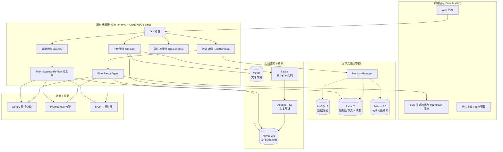

# SuperBizAgent

<p align="center">
  
  
  
  
  
  
  
  
</p>

**SuperBizAgent** 是一个基于 **Go 1.26+**、**GoFrame v2** 与字节跳动 **CloudWeGo Eino** 框架构建的业务智能体（Agent）与混合检索（RAG）实践项目。项目主要探索在业务场景中结合会话记忆管理、Milvus 混合检索、异步文档处理以及辅助排障等工程落地实践。

---

## 📌 功能概览

### 1. 双路混合检索 (Hybrid RAG)
- **内置 BM25 稀疏向量**：利用 Milvus 2.5 的 `BM25 Function`，入库时由向量库服务端处理分词并建立倒排索引，减少应用端文本分词计算。
- **混合检索与加权融合**：通过 Milvus 原生 `HybridSearch` 同时发起稠密向量（阿里百炼 `qwen3.7-text-embedding`，2048维）与 BM25 关键词检索，配合服务端 `WeightedRanker` 融合排序，改善专有名词与标识符的召回表现。

### 2. 会话上下文与分层记忆
- **MySQL 数据持久化**：存储完整会话和消息流水，便于历史记录回溯与审计。
- **Redis 短期上下文缓存**：维护近期活跃对话轮次，并在轮次较多时通过大模型生成阶段摘要，控制上下文长度。
- **Milvus 经验检索**：异步存储问答片段向量，通过相似度阈值过滤，为跨会话问答提供相关历史背景参考。

### 3. 分片断点上传与异步向量化
- **断点续传与状态记录**：前端按 5MB 分片上传，通过 Redis Bitmap 记录分片接收状态，支持续传与秒传判定。
- **MinIO 对象合并**：分片上传完成后，调用 MinIO `ComposeObject` 合并保存为完整文件。
- **Kafka 异步处理流水线**：文件合并后通过 Kafka 异步解耦，后台消费者调用 Apache Tika 提取文本内容，并通过 Eino 知识流水线切片和向量化入库，避免阻塞上传请求。

### 4. 辅助排障与智能体工具调用
- **Agent 编排**：基于 Eino 编排 ReAct 模式与 Plan-Execute-RePlan 多步规划流程。
- **内置工具集**：
  - **Sentry 查询**：支持通过 Trace ID、Issue ID 查看异常堆栈与错误信息。
  - **Prometheus 告警查看**：获取系统当前的告警指标数据。
  - **只读数据查询**：辅助查询数据库业务状态。
  - **MCP 协议支持**：对接符合 Model Context Protocol 规范的外部工具。

### 5. 流式输出与前端交互
- **SSE 流式传输**：采用 Server-Sent Events 实现逐字流式返回。
- **前端交互界面**：基于原生 JavaScript / CSS 构建，支持 Markdown 实时渲染、思考中状态提示、知识库文档上传、预览与删除。

---

## 🏛️ 系统架构图



---

## 💻 技术栈

| 模块 | 组件 / 库 | 用途说明 |
| :--- | :--- | :--- |
| **开发语言** | Go 1.26+ | 服务端核心实现 |
| **Web 框架** | GoFrame v2.7.1 | HTTP 路由、中间件与脚手架 |
| **AI 编排** | CloudWeGo Eino v0.6.0 | 大模型组件调用与 Agent 图编排 |
| **向量数据库** | Milvus v2.5.4+ | 稠密向量与 BM25 全文检索 |
| **大语言模型** | DashScope / OpenAI 兼容接口 | 对话生成与摘要总结（如 DeepSeek、Qwen） |
| **向量模型** | 阿里百炼 `qwen3.7-text-embedding` | 2048 维文本嵌入 |
| **对象存储** | MinIO | 文档原文件与分片存储 |
| **消息队列** | Kafka 7.2.1 (KRaft 模式) | 文档解析异步解耦 |
| **缓存 / 状态** | Redis 7.2 | 分片位图与近期对话缓存 |
| **关系型数据库** | MySQL 8.0 (GORM) | 会话流水与文档信息持久化 |
| **文本抽取** | Apache Tika | 解析 PDF、DOCX、TXT、MD 等格式 |
| **错误追踪** | Sentry SDK | 运行时报错捕获与排障辅助 |
| **前端实现** | 原生 HTML5 / CSS3 / ES6+ | 静态界面与流式通讯 |

---

## 📂 目录结构

```text
SuperBizAgent/
├── api/                               # 接口入参和回包定义
│   └── chat/v1/                       # 对话、上传、文档管理等结构体
├── docs/                              # 设计文档与 SQL 脚本
│   ├── sql/memory_schema.sql          # 数据库初始化 DDL
│   ├── PLAN_CONTEXT_ENGINEERING_MEMORY.md # 记忆模块设计说明
│   ├── PLAN_MILVUS_NATIVE_BM25_HYBRID.md  # 混合检索实现细节
│   └── PLAN_SUPERBIZ_AGENT_RAG_OPTIMIZATION.md # 分片上传与异步处理方案
├── etc/                               # 配置与容器环境
│   ├── config/
│   │   ├── config.yaml                # 运行配置（需自行配置密钥）
│   │   └── config.yaml.example        # 配置示例
│   └── docker/
│       └── docker-compose.yml         # 基础依赖服务编排文件
├── Frontend/                          # 前端页面目录
│   ├── index.html                     # 页面结构
│   ├── app.js                         # 前端逻辑实现
│   └── styles.css                     # 样式与动画
├── internal/                          # 核心业务实现
│   ├── ai/                            # AI 相关逻辑
│   │   ├── agent/                     # 对话流、索引流水线与记忆管理
│   │   ├── embedder/                  # 向量嵌入封装
│   │   ├── indexer/                   # 向量写入封装
│   │   ├── retriever/                 # 检索逻辑
│   │   └── tools/                     # 工具集（Sentry、Prometheus 等）
│   ├── config/                        # 配置映射
│   ├── controller/chat/               # HTTP 控制器
│   ├── logic/kafka/                   # Kafka 消费者处理
│   └── model/                         # 数据表实体
├── pkg/                               # 基础组件封装
│   ├── bitmap/                        # Redis 位图辅助方法
│   ├── client/                        # 客户端单例（MySQL、Redis、Milvus 等）
│   ├── middleware/                    # HTTP 中间件
│   ├── sse/                           # SSE 发送封装
│   └── storage/                       # MinIO 操作封装
├── go.mod                             # Go 依赖配置
└── main.go                            # 入口文件
```

---

## 🚀 快速启动

### 1. 前置依赖
- Go 1.24+（推荐 1.26+）
- Docker & Docker Compose
- MySQL 8.0 数据库实例

### 2. 启动依赖组件
使用 Docker Compose 启动 Milvus、MinIO、Redis、Kafka 及 Tika：

```bash
docker-compose -f etc/docker/docker-compose.yml up -d
```

> **主要组件端口**：
> - Milvus: `19530`
> - Attu (Milvus Web 控制台): `http://localhost:8000`
> - MinIO: `9000`（控制台: `http://localhost:9001`，账号密码: `minioadmin` / `minioadmin`）
> - Redis: `6379`
> - Kafka: `9092`
> - Apache Tika: `http://localhost:9998`

### 3. 初始化数据库
执行初始化 SQL 创建对应数据表：

```bash
mysql -h 127.0.0.1 -P 3306 -u root -p < docs/sql/memory_schema.sql
```

### 4. 准备配置文件
复制配置模板并配置大模型 API Key 及数据库连接：

```bash
cp etc/config/config.yaml.example etc/config/config.yaml
```

在 `etc/config/config.yaml` 中补充必要的 Key：
```yaml
server:
  address: ":6872"

ds_think_chat_model:
  api_key: "your-dashscope-api-key"
  base_url: "https://dashscope.aliyuncs.com/compatible-mode/v1"
  model: "deepseek-v4.1-flash"

doubao_embedding_model:
  api_key: "your-dashscope-api-key"
  base_url: "https://dashscope.aliyuncs.com/compatible-mode/v1"
  model: "qwen3.7-text-embedding"

mysql:
  dsn: "root:password@tcp(127.0.0.1:3306)/superbiz_agent?charset=utf8mb4&parseTime=True&loc=Local"
```

### 5. 编译与运行后端
```bash
# 下载依赖
go mod download

# 编译运行
go build -o SuperBizAgent.exe main.go
./SuperBizAgent.exe
```

### 6. 运行前端
可使用任一静态服务器运行前端目录，例如：

```bash
cd Frontend
npx http-server -p 8080 -c-1
```
在浏览器中打开 `http://localhost:8080` 即可使用。

---

## 📡 接口示例

### 1. 流式对话 (`POST /api/chat_stream`)
```bash
curl -N -X POST http://127.0.0.1:6872/api/chat_stream \
  -H "Content-Type: application/json" \
  -d '{
    "id": "session-123",
    "question": "简单介绍一下系统的主要功能"
  }'
```

### 2. 文件分片上传流程

1. **检查分片进度 / 秒传**：`POST /api/upload/check`
   ```bash
   curl -X POST http://127.0.0.1:6872/api/upload/check \
     -H "Content-Type: application/json" \
     -d '{"fileMd5": "sample_md5_hash", "fileName": "manual.pdf", "totalChunks": 3}'
   ```
2. **上传分片**：`POST /api/upload/chunk`
   ```bash
   curl -X POST http://127.0.0.1:6872/api/upload/chunk \
     -F "file=@part-0.chunk" \
     -F "fileMd5=sample_md5_hash" \
     -F "chunkIndex=0" \
     -F "totalChunks=3"
   ```
3. **通知合并**：`POST /api/upload/merge`
   ```bash
   curl -X POST http://127.0.0.1:6872/api/upload/merge \
     -H "Content-Type: application/json" \
     -d '{"fileMd5": "sample_md5_hash", "fileName": "manual.pdf", "totalChunks": 3, "totalSize": 12582912}'
   ```

### 3. 知识库文档管理
- **列表查询**：`GET /api/documents/list`
- **在线预览**：`GET /api/documents/preview?fileMd5=sample_md5_hash&fileName=manual.pdf`
- **下载链接**：`GET /api/documents/download?fileMd5=sample_md5_hash&fileName=manual.pdf`
- **删除文档**：`DELETE /api/documents/:fileMd5`

---

## 🧪 运行测试

```bash
go test -v ./...
```

---

## 📄 许可协议

本项目遵循 [MIT License](LICENSE) 开源协议。
